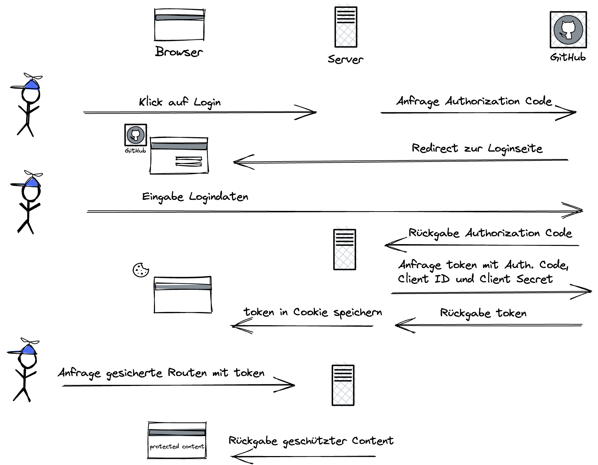

# Authentifizierung mit NextAuth

## Was ist Authentifizierung?

Authentifizierung ist die Verifizierung der Identität eines Benutzers.
Authentifizierung beantwortet die Frage "Wer ist der Benutzer?", Autorisierung hingegen die Frage "Was darf der Benutzer?"

## Warum brauchen wir das?

Viele unserer Apps erlauben es dem Benutzer, eigene Daten zu speichern und wieder abzurufen.

Um die Daten eines Benutzers vor dem Zugriff anderer Benutzer zu schützen, müssen wir dafür sorgen, dass unsere API geschützte Daten nur an einen authentifizierten User zurückgibt.

Außerdem möchten wir in unserer Web-App bestimmte Funktionalitäten nur für angemeldete Nutzer sichtbar machen und den Nutzer z.B. mit seinem Namen begrüßen können.

## Was sind Authentication Provider?

Authentication Provider sind Institutionen/Systeme, die die Identität eines Nutzers für uns überprüfen.
Bekannte Authentication Provider sind z.B. Google, Facebook oder (unter Entwicklern) Github.

Hat sich ein Nutzer erfolgreich authentifiziert, stellen die Systeme ihm einen zeitlich begrenzten "Pass" in Form eines digital signierten Authentifizierungs-Tokens aus.
Mit diesem Token ruft der Nutzer dann unsere geschützten API-Routen auf. Da wir dem Authentication Provider und der digitalen Signatur vertrauen, können wir den privaten Content des Users ausgeben.

## Was passiert im Hintergrund?

## Was ist NextAuth?

NextAuth ist ein Package, das uns sehr viele Aspekte des Authentifizierungs-Flows abnimmt, insbesondere die Kommunikation mit den Authentication Providern und den Zugriff auf Informationen zum eingeloggten User.

## Wie integrieren wir NextAuth in unsere App?

Die Beispiel-Integration erfolgt mit dem Github-Provider, die Integration anderer Provider funktioniert nach dem gleichen Schema.

- Getting started: [NextAuth documentation](https://next-auth.js.org/getting-started/example)
- **WICHTIG**: next.js v12.2.5, next-auth funktioniert noch nicht mit der aktuellen next.js Version v12.3.1
  - Das Capstone Template verwendet v12.2.5, hier sollte also kein Problem entstehen
- Installieren mit `npm i next-auth`
- Github Apps konfigurieren:

  - Unter Settings / Developer Settings / OAuth Apps
  - Für Production mit der Production Domain
  - Für http://localhost:3000 für die lokale Entwicklung
  - Callback URL: Host + `/api/auth/callback/github`
  - Client ID und Client Secret kopieren

- `/auth/[...nextauth].js` Datei im /api Folder erstellen und gemäß Dokumentation konfigurieren
- In `_app.js` `SessionProvider` importieren und gemäß Dokumentation einbinden
- `.env.local` erstellen und ID und Secret der lokalen Github-App hinterlegen
- `useSession`, `signIn` und `signOut` verwenden, um User ein- und auszuloggen
- `unstable_getServerSession` verwenden, um die API Routen zu schützen
- Deployment:
  - Auf Vercel Umgebungsvariablen mit den gleichen Namen anlegen, hier aber ID und Secret der Github Production App eintragen
  - Zusätzlich bei Vercel `NEXTAUTH_SECRET` (erforderlich für Production) eintragen (generieren z.B. mit `openssl rand -base64 32`)
